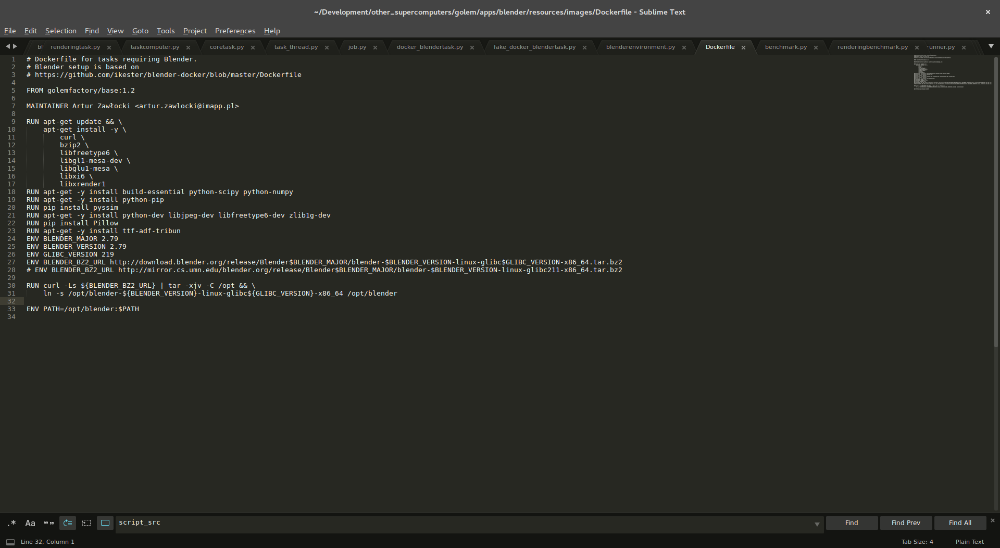
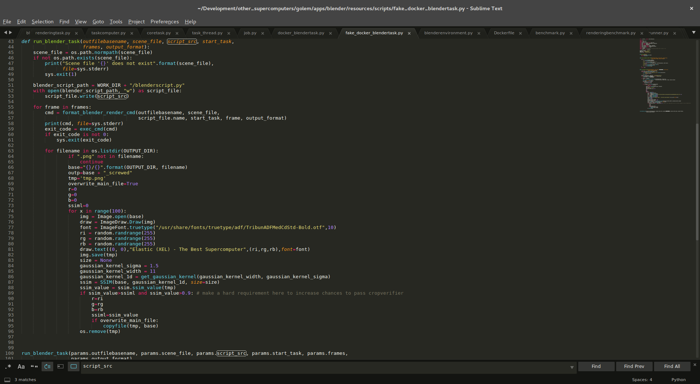
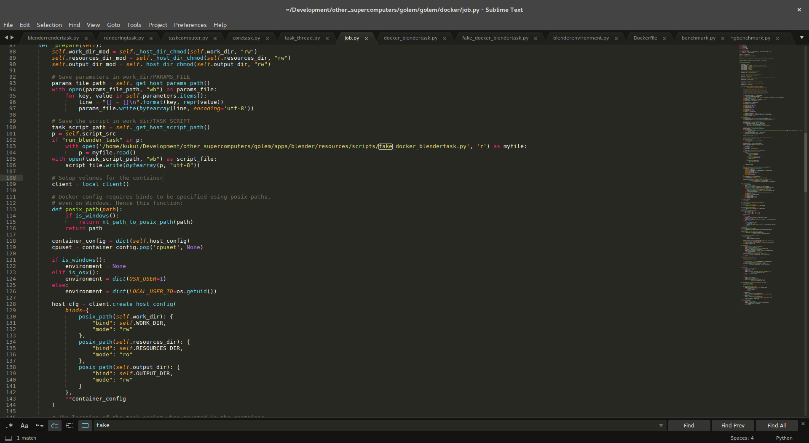
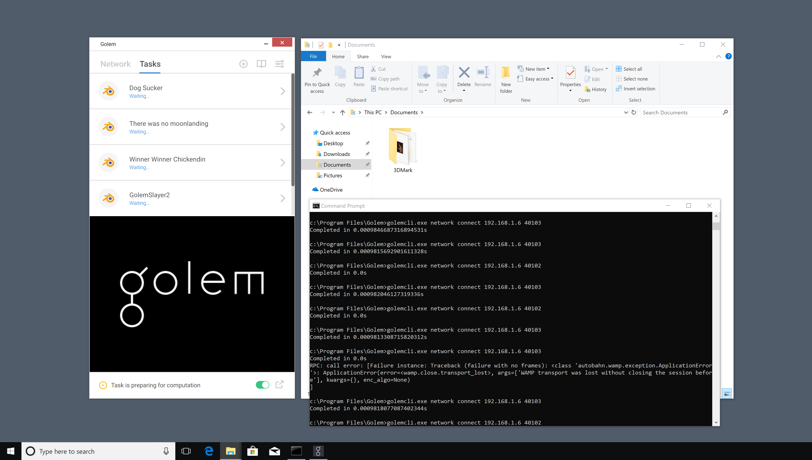
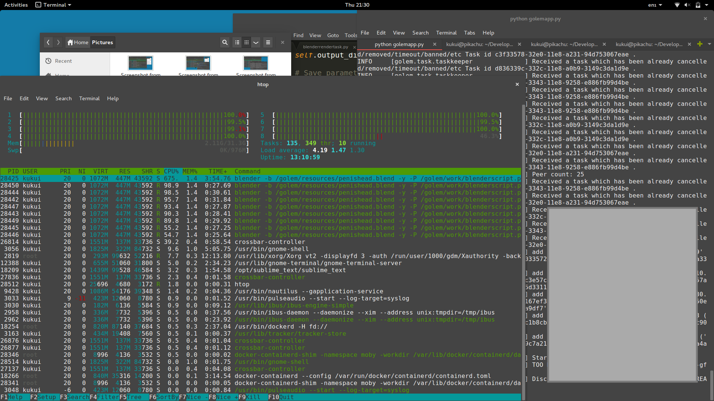
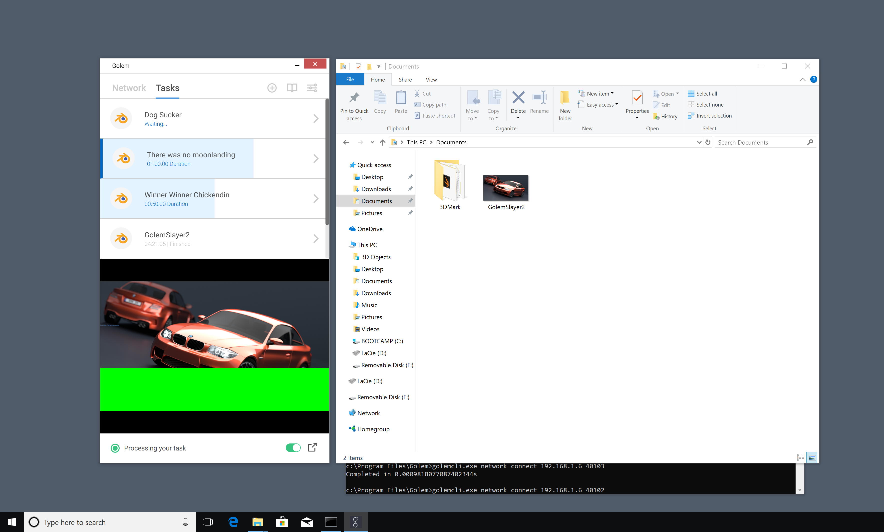
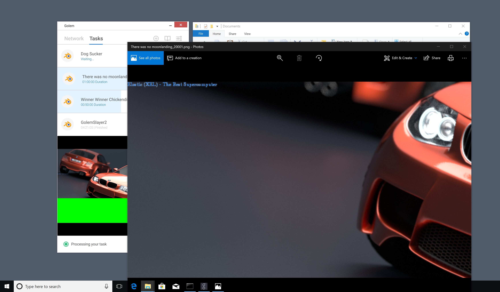

## How I discovered a security issue in Golem, and 

...why I think it will be close to impossible to get it handled correclty. -- by Kanbanana Joe

One thing beforehand, those of you who love me, can give me some tasty BTC:
1Dqy8z86VA28Qp133UjZZNAJN1XXwzx4bw

But what comes next is my gift for you guys and, most importantly, to the Golem devs. You do not want to go to mainnet as this.

But lets go back to the start. I was really excited about the latest Golem blog post; Golem (KanBan or so) finally goes mainnet. Somewhere else I have also read that every release is undergoing thorough security checks. Sounds as if everything is perfectly fine; how else could there be enough time for holding talks at conferences and taking extensive care of the Twitter account. I should be proven wrong, later on. But let me first start with this: This is no rant or anything, and I am not trying to bash Golem. Clearly, my heart beats for the Elastic project (it just appeals to me a bit more from the technological perspective(, but in the end we all have that one goal - move forward crypto for a better world. So I hope that this disclosure will open some eyes (leave some mouths open) and remind people that design indeed has priority over marketing and social media. I know that the Elastic project (one of the fanciest super computers which allows the execution of self-programmed tasks) has been criticized for disappearing in a black hole for months, into a shady cloud full of coding and never even reporting a word about what they do. But I really think that this was a wise choice in the end! They got their verification algorithm straight; when jobs are properly coded, I cannot see any way how the work verification can be tricked whatsoever.

Anyway, today started as usual. I was enjoying my caipirinha and one of my favourite smokes in the heat of the sun and I thought "hell, yeah, lets just take a look at the source code for a second". I opened up my 10 yr old smartphone and began scrolling through the Github sources. What I saw there made me throw away that caipirinha and rush to my computer as fast as I can.

What I discovered was an easy (well, easy is relative) way of circumventing the work verification routine in Golem. You are right, I have found a way to manipulate the results that my computation node produces so that it returns garbage (garbage which is verified as a perfectly correct result). Not exactly what you want in the mainnet that is so passionately summoned by various Twitter community. Why is it so important? Well, I will take you on to a journey where you will see how I injected an "Elastic adversitement slogan" in every single rendering task that my node has been working on - and I got paid for it :)

The issue, however, is a much more crucial one. In Golem's verification mechanism (as of now), there is unfortunately no way to circumvent it, not now and not on the mainnet, except to verify the entire work once again. But why renting CPU power in the first place, if you have to re-render everything yourself again. This just doesn't work out.

Anyway, I whipped out my old Acer netbook with around 8 GB of storage and unbelieveable 1 GB RAN and pulled the Golem github. After setting up the Development environment I tried to find out more about the metric Golem is using for the verification of a rendered subtask. I quickly found the answer: What they are basically doing it rendering a small portion of the original job, cutting the same portion from the image received from a computation node and calculating the SSIM value. The SSIM *structural similarity" is a widely adopted methodology to assess the "quality decrease" of an image after some preprocessing step. So if you have the original image, and you add some error noise to it, the SSIM value is likely decreasing form 100% (identical image) downwards. Golem requires at least 80% SSIM for a rendering to pass as correct. The fun fact, and I would expect an "security firm conducting audits" to see it, is that the SSIM is fairly invariant to Gaussian blur. If you render the image, add some nasty looking Gaussian blur and return it to the buyer, it will very likely pass as correct even though the buyer can do nothing more than just throw the result in the bin. But that would be to easy, let us do something funnier.

But before we start, let I had to do something else. We all know, size does matter. The guy with the fastest car wins the race, the guy with the sleekest clothes takes the girl home, and of course the fastest node will attract the most work in the network. It's all about attractiveness. So I slightly modified the Blender benchmark routine to result in a six times higher Benchmark score. This was a two letter patch ("*6" essentially). Obviously, this value is all about trust.

First thing that was required is to patch the Dockerfile of the blender rendering Docker image, we just need some more dependencies that we will work with later on. Check this out

This now allows us to use a slightly modified version of the original routine which is responsible of rendering the requested image inside the docker container. The original code resides inside docker_blendertask.py. We are not allowed to touch that file though, because its content gets sent back to the buyer when the task has finished to he can verify "that the code is actually what he wished for". Funnily enough, only the content of this file is sent back, not what is actually run inside the Docker container. I just created a file called fake_docker_blendertask.py and put in my modified code there.

Before I tell you why this step is cruicial, let us first take a look at what I am doing in the modified Docker task program. Those of you who are aware of coding will see it immediately. I am basically letting run Blender and produce its output. Then, in a second step, I open the image and go into a loop of 100 tries. In each of the tries a different color is picked and the text "Elastic (XEL) - The Best Supercomputer" is rendered onto the image we just got from Blender. For each different color, I am calculating the SSIM value compared to the untouched version of the image. After 100 tries I take the version with the highest SSIM value; most likely it is some color that blends in nicely without causing many interferences in the variance of the image which again would decrease the SSIM too much. I only return the modified image if I manage to modify it while still staying over a SSIM of 0.9. This is almost always the case.

Anyway, as I told you before, modifying the docker_blendertask.py itself would cause many headaches so let us take a look at job.py. It is very straight forward where we can intercept what is written to the Docker instance and replace it by the fake content. This leaves the "cryptographical checks" in place and the "signatures" will pass when the buyer verifies the work.

Now, we are basically ready to go. Let us fire up a windows rig and create a whole bunch of jobs. Forgive me the file names lol, I was sill a bit pissed that I had to throw away my Caipirinha.

After dozens of connectivity issues (not my fault *grin*) the computation node pick up the work

The windows rig quickly showed first results, but wait!! Oh my gosh! 

What is this tiny little blueish ugly artifact right beneath the smaller BMW in the upper left corner?? Let us take a closer look!

Aaaand there you go, an Elastic Photobomb, smuggled into the image, verified correctly by the node, and paid for as expected. And the bad thing is, even if you proceed to mainnet, this will be possible as well.

Everyone who renders an image through this corrupted computation node will end up with this Photobomb in his results. While funny to us, not very funny to a contractor who needs to deliver some tasty shiny deliveries to his raging boss at 9 in the morning.

Hope this helps the Golem devs to take what ever countermeasures they think might help. Unfortunately, and I can only rely on my personal skillset, I cannot see any convenient way to avoid this.

Thanks for reading

Kanban(ana) Joe
